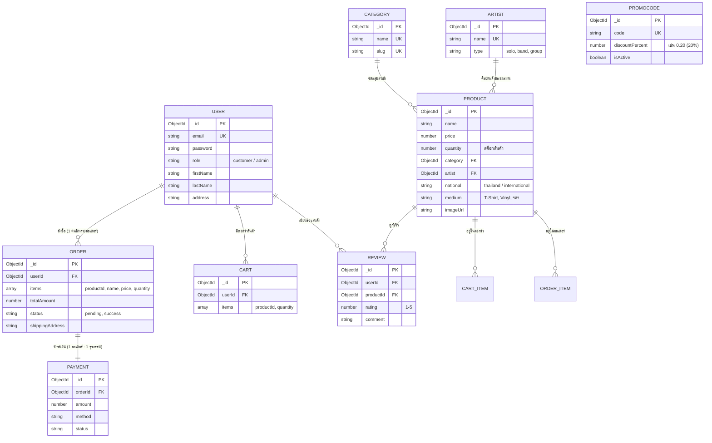

# 🛒 Merchroom — Database Summary & ER Diagram (Presentation Guide)

เอกสารสรุปโครงสร้างฐานข้อมูลและสถาปัตยกรรมระบบ **Merchroom** สำหรับใช้ประกอบการนำเสนอ (Presentation)

---

## 1. ภาพรวมระบบฐานข้อมูล (Database Overview)
ระบบใช้ **MongoDB (NoSQL)** ควบคุม Schema ผ่าน **Mongoose** โดยประกอบด้วย **9 Collections หลัก** ที่ทำงานร่วมกันอย่างเป็นระบบ รองรับทั้งฝั่งลูกค้า (Customer) และผู้ดูแลระบบ (Admin)

---

## 2. ER Diagram (Entity-Relationship Diagram)

---

## 3. สรุปรายละเอียดแต่ละ Collection (อธิบายง่ายๆ สำหรับ Presentation)

### 👤 1. User (ผู้ใช้งานระบบ)
*   **หน้าที่:** จัดการข้อมูลสมาชิกและผู้ดูแลระบบ
*   **จุดเด่น:** รองรับหลายบทบาท (`role`: `customer` หรือ `admin`) เก็บข้อมูลที่จำเป็นสำหรับการสั่งซื้อ เช่น ที่อยู่ (`address`) และเบอร์โทรศัพท์

### 📦 2. Product (สินค้าในร้าน)
*   **หน้าที่:** เก็บรายการสินค้าทั้งหมดของ Merchroom (เช่น เสื้อวง, แผ่นเสียงไวนิล, อุปกรณ์สะสม)
*   **จุดเด่น:** เชื่อมโยงกับหมวดหมู่ (`Category`) และศิลปิน (`Artist`) เพื่อให้ผู้ใช้ค้นหาง่ายตามสไตล์และที่มา

### 🗂️ 3. Category (หมวดหมู่สินค้า)
*   **หน้าที่:** แบ่งหมวดหมู่สินค้า เช่น Thai Heritage, Pop Culture, Accessories
*   **จุดเด่น:** มีฟิลด์ `slug` สำหรับใช้ทำ Friendly URL (เช่น `/products?cat=thai-heritage`)

### 🎤 4. Artist (ศิลปิน / ค่ายเพลง)
*   **หน้าที่:** เก็บประวัติและข้อมูลของศิลปินที่เป็นเจ้าของลิขสิทธิ์สินค้า
*   **จุดเด่น:** แยกออกมาเป็นอิสระ เพื่อให้สามารถแสดงโปรไฟล์ศิลปินและรวมผลงานเพลง/สินค้าของศิลปินคนนั้น ๆ ได้

### 🛒 5. Cart (ตะกร้าสินค้า)
*   **หน้าที่:** เก็บรายการสินค้าที่ผู้ใช้กำลังเลือกซื้อก่อนชำระเงิน
*   **จุดเด่น:** ผูกกับ `userId` และเก็บอาเรย์ของรายการสินค้า (`items`) พร้อมจำนวนชิ้น (`quantity`)

### 🧾 6. Order (คำสั่งซื้อ)
*   **หน้าที่:** บันทึกประวัติการสั่งซื้อเมื่อลูกค้าทำรายการสำเร็จ
*   **จุดเด่น:** ใช้การฝังข้อมูลสินค้าแบบ Snapshot (`items` เก็บชื่อและราคา ณ วันที่ซื้อ) ป้องกันปัญหาราคาสินค้าในอนาคตกระทบออเดอร์เก่า

### 💳 7. Payment (การชำระเงิน)
*   **หน้าที่:** บันทึกสถานะและช่องทางการชำระเงินของแต่ละออเดอร์
*   **จุดเด่น:** ความสัมพันธ์แบบ 1 ต่อ 1 กับ `Order` (`orderId`) ตรวจสอบสถานะการจ่ายเงินได้ชัดเจน (`pending`, `success`)

### ⭐ 8. Review (รีวิวสินค้า)
*   **หน้าที่:** เก็บความคิดเห็นและคะแนนความพึงพอใจ
*   **จุดเด่น:** เชื่อมโยงระหว่าง `User` และ `Product` พร้อมให้คะแนน 1-5 ดาว และคอมเมนต์

### 🎟️ 9. PromoCode (โค้ดส่วนลด)
*   **หน้าที่:** จัดการคูปองโปรโมชันส่วนลด
*   **จุดเด่น:** กำหนดอัตราส่วนลดเป็นเปอร์เซ็นต์ (`discountPercent` เช่น 0.20 = ลด 20%) และกำหนดวันหมดอายุได้

---

## 4. สถาปัตยกรรมระบบโดยรวม (System Architecture)
*   **Frontend:** React 19 + Vite + Tailwind v4 (SPA - Single Page Application) โครงสร้างแยกเลเยอร์ชัดเจน (Pages -> Sections -> UI Components) มียจัดการ State ตะกร้าด้วย `CartContext`
*   **Backend:** Node.js + Express (โครงสร้างโมดูล CommonJS) ร่วมกับ Mongoose ODM
*   **Database:** MongoDB Atlas (Cloud Database) พร้อมสคริปต์ Seed ข้อมูลแบบ Idempotent (`bulkWrite` + `upsert`) รันซ้ำได้โดยไม่สร้างข้อมูลเบิ้ล
